# Step Dashboard

A custom dashboard for my electric scooter, running on a Raspberry Pi 4 wired to
a VESC controller over USB.

**[English](#english)** · **[Nederlands](#nederlands)**

> *TRANSLATED WITH CLAUDE, UI MADE BY CLAUDE DESIGNER*
>
> *VERTAALD MET CLAUDE, UI GEMAAKT DOOR CLAUDE DESIGNER*

---

## English

A Raspberry Pi 4 hangs off the VESC controller over USB and shows speed, battery,
temperatures and the rest fullscreen on a 3.5" display mounted on the handlebars.

The VESC phone app is fine, but I don't want to ride with a phone in a cradle —
and I want to decide myself what goes on that screen.

### What it does

One screen while you ride: the speed big in the middle, the battery underneath
it, and three cards with trip, odometer and temperatures. On the left rail sit
the notification bell and the riding mode, on the right the duty bar. Everything
else is a layer that slides over it.

Tap the speed and you get the readout — current, top, average, and a timer for
the trip. Tap the trip card and it flips to consumption in Wh/km. Tap the top
bar and you're in the settings.

Beyond that:

- **Four languages.** Dutch, English, French and German. Switching takes effect
  immediately, mid-ride, without a restart.
- **Metric or imperial.** km/h · km · °C, or mph · mi · °F — everywhere at once,
  including the temperature limits.
- **Eight accent colours**, and a day and a night theme.
- **Three temperature limits** — motor, controller, battery — each with its own
  switch, so a dead sensor doesn't have to mean a screen full of red. Reach a
  limit with its switch on and a warning fills the screen. It blinks seven times
  and stays until you acknowledge it, and it only comes back once everything has
  been five degrees below the limit.
- Faults, a nearly empty battery and a motor warming up show up as
  notifications. The bell colours and blinks; tapping it opens the drawer. They
  clear themselves when the cause is gone.
- Joining a Wi-Fi network needs no keyboard — there's one on screen, with shift,
  a symbol layer and an eye to reveal what you typed.
- **Cruise control shows up on screen.** The VESC doesn't report it, so the Pi
  infers it — throttle released while the motor keeps pulling and the speed
  holds. Only works with an ADC throttle, and only ever claims it when it's
  sure.
- **ECO and SPORT.** With `modes.enabled` on in `config.json`, a button appears
  next to the speed that sets the VESC's limits — current, speed, duty, watts.
  It goes to the controller's working memory, never to flash, and the scale can
  only go down, never up.
- If the VESC doesn't know how the scooter is put together, an extra row appears
  in the settings where you can fill in wheel size, pole pairs, gearing and cell
  count yourself. Does it know? Then the app copies the values off it while you
  ride and writes them into `config.json`, and the row stays hidden.
- On boot it checks whether a newer version is on GitHub. If there is, the top
  row of the settings blinks. Tapping it shows the actual commits between what's
  running and what's ready, and a button to install.
- Plug in the charger and a charging screen appears: percentage, a bar, and an
  estimate of how much longer it needs. Tap it away if it's in the way.
- Settings → Power gives reboot and shutdown, so you can put the Pi down
  properly instead of pulling the plug.

What the VESC doesn't measure, the app doesn't invent. Battery temperature is
the clearest case: there's no sensor input for it on the controller, so the
limit is there and the reading says **n/a**.

Everything runs locally. No internet needed, no CDNs, no external fonts — the
scooter is often out of range and it should just work.

### The screens

| | | |
|---|---|---|
| 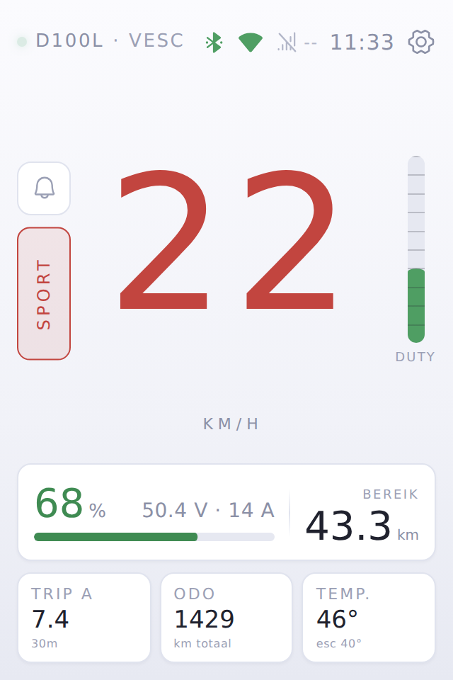 | 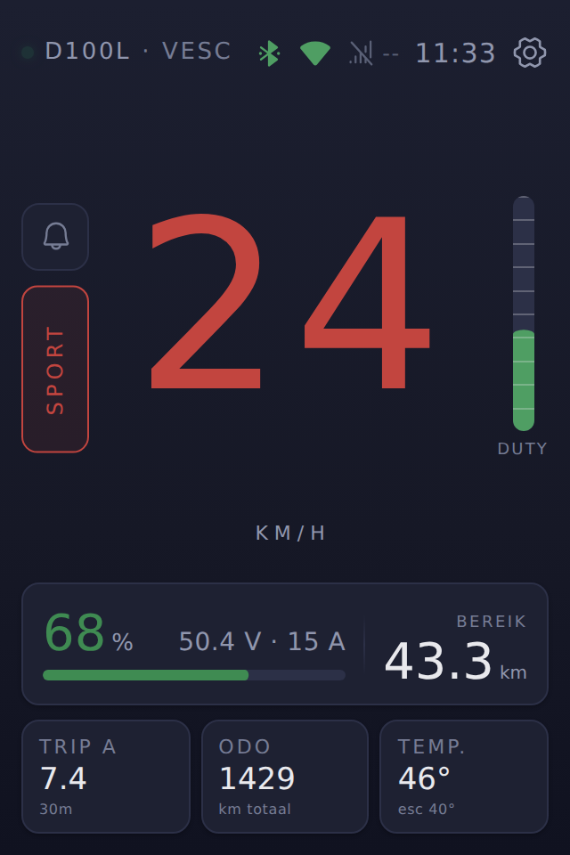 | 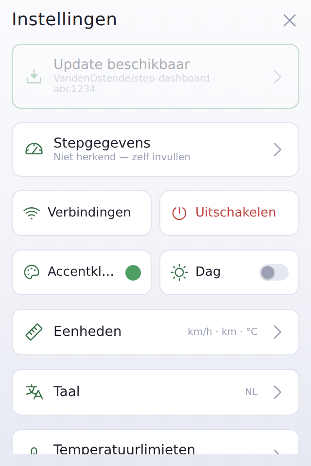 |
| Riding, day | The same, night | Settings |
| 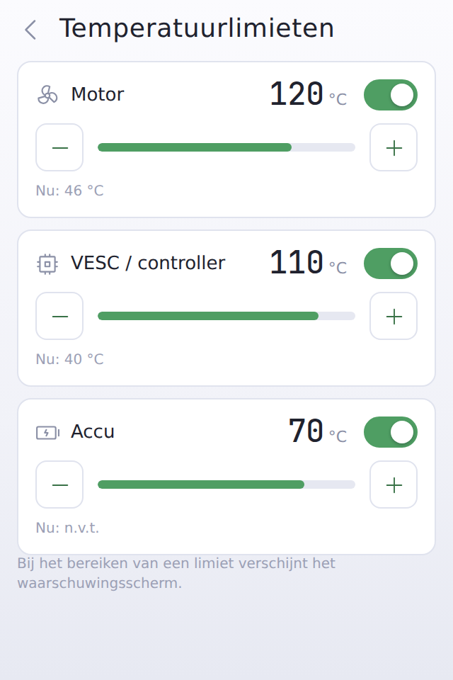 | 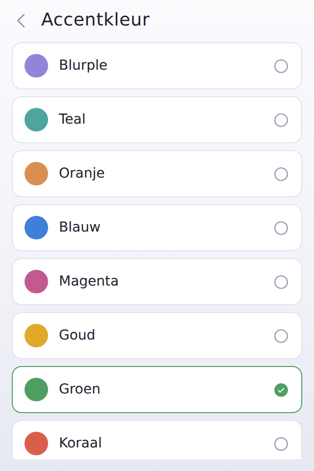 | 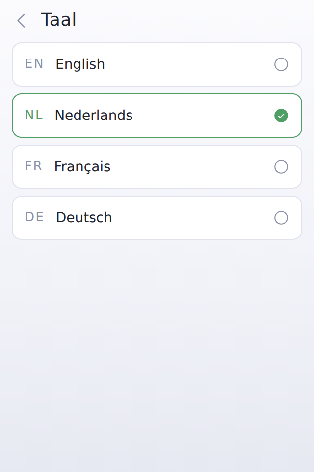 |
| Temperature limits | Accent colour | Language |
| 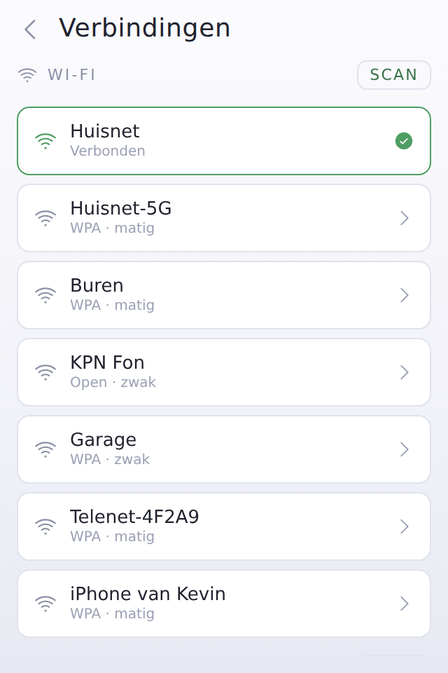 | 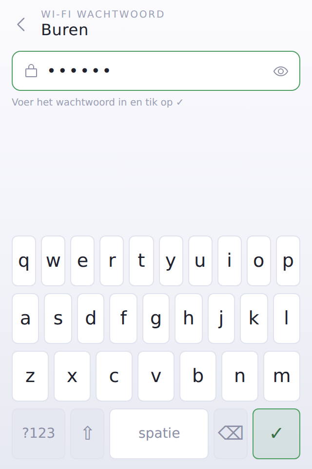 | 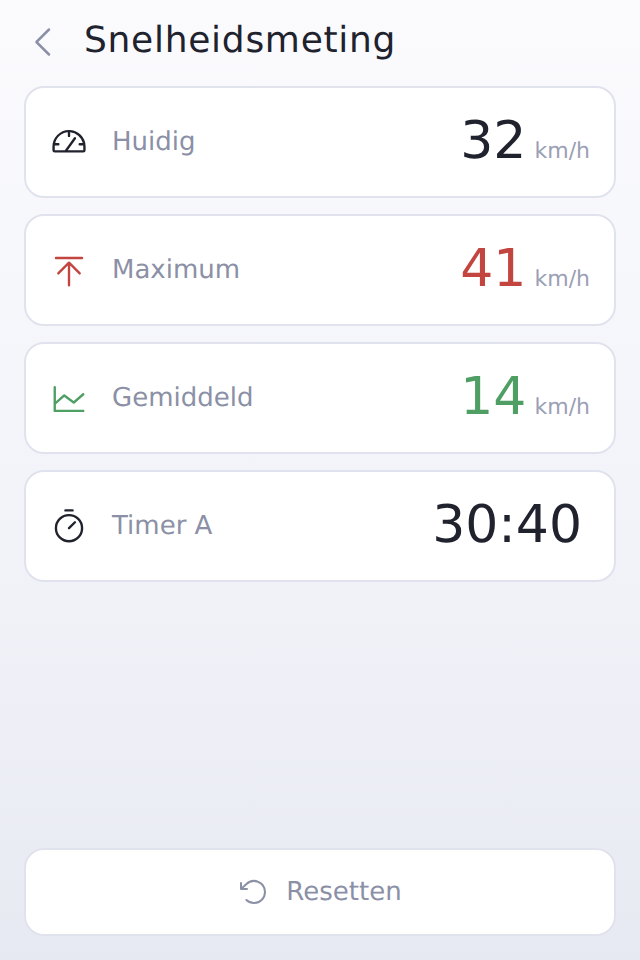 |
| Connections | On-screen keyboard | Speed readout |
| 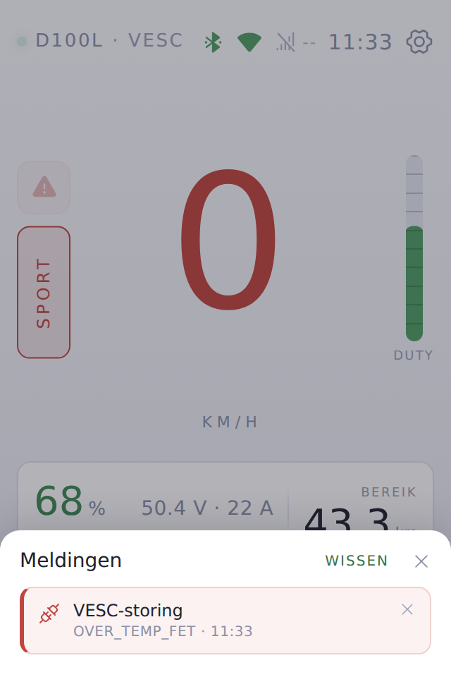 | 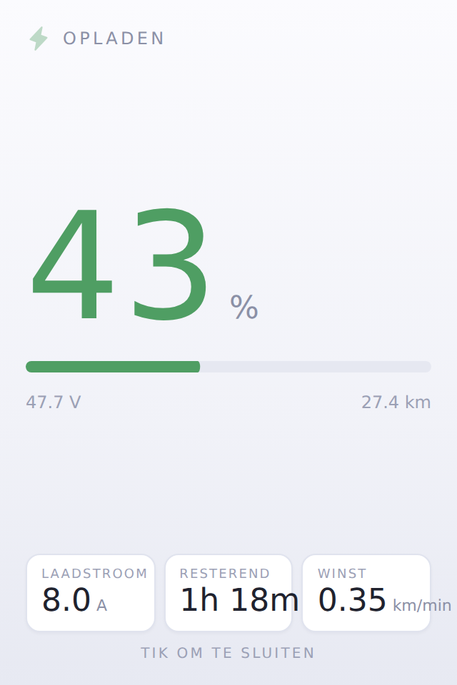 | 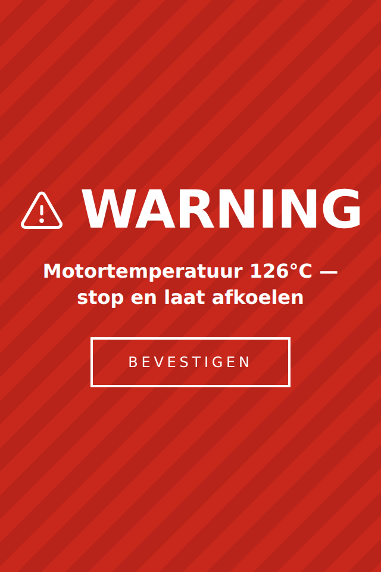 |
| Notifications | Charging | Temperature warning |
| 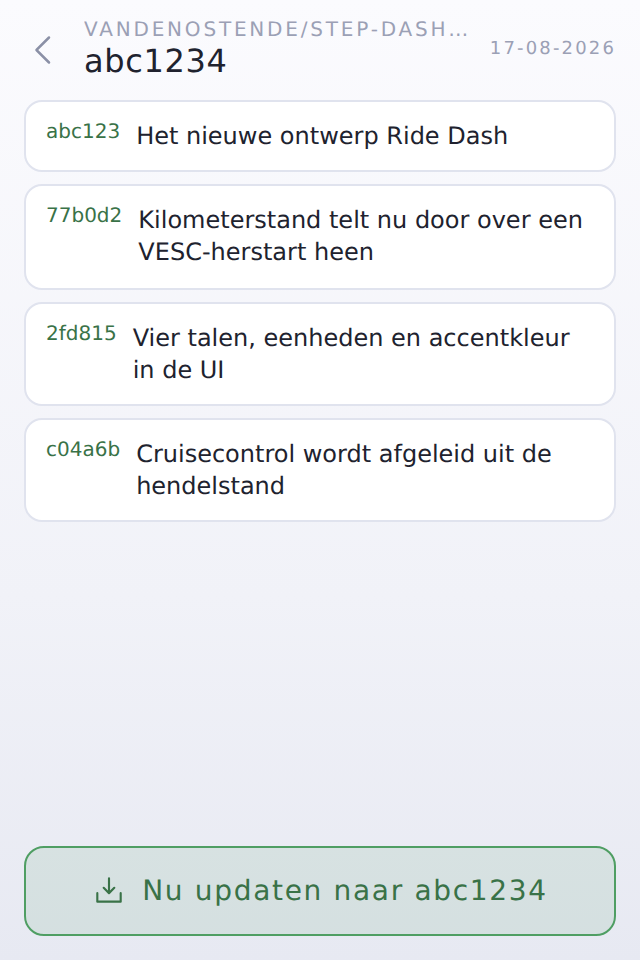 | 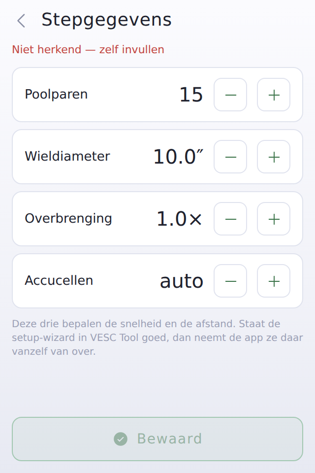 | 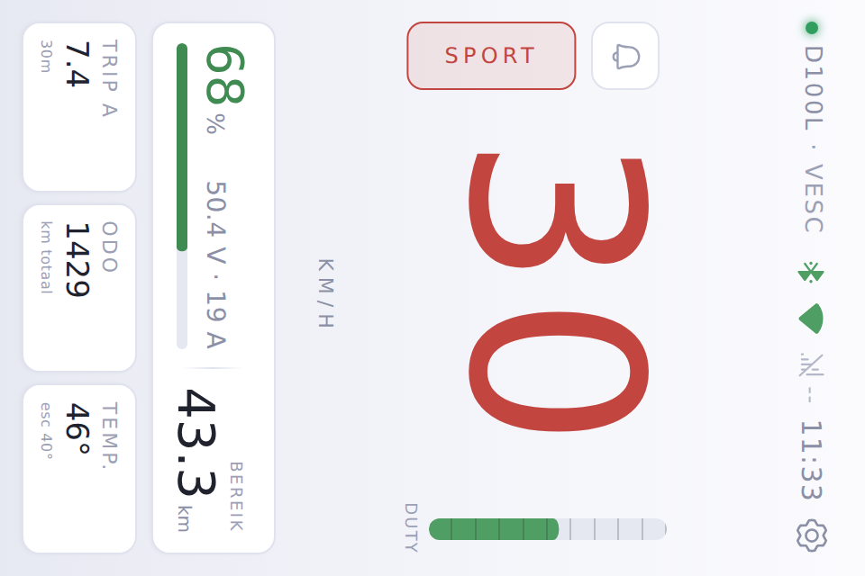 |
| What's in the update | Scooter values | As it hangs on the bars |

These are the real pages, taken from the design environment with
`node tools/shots.js` — not mock-ups.

### Hardware

- Raspberry Pi 4 (4 GB, though 2 GB is plenty)
- VESC controller over USB — mine is a Flipsky Mini MK5
- 3.5" SPI touchscreen, 480 × 320 — the page turns itself, see below
- Optional: a 5G dongle, for the signal bars in the top bar

The interface is Ride Dash, drawn in Claude Design and rebuilt here as plain
HTML and CSS. Portrait 320 × 480, one flat surface with cards on it, a 1 px
border and no fills, and one accent colour that runs through everything you can
tap. Day and night are two palettes of the same shape. The 45 icons are
Phosphor (MIT), baked into the page as one SVG sprite — the Pi has no internet
and nothing may come from a CDN.

Inter is the typeface. `install.sh` installs it (`fonts-inter`); without it the
UI falls back to system-ui, which is readable but pushes the digits out of their
columns.

The display is slow — it hangs off SPI, so every repaint has to be pushed over
that bus. So the UI paints only what actually changed, has no transitions on
anything that updates while you ride, no CSS animation that runs forever, and
doesn't paint the ride screen at all while something covers it. `npm run bench`
measures it; the numbers and the reasoning are in
[`pi/README.md`](pi/README.md#light-enough-for-the-panel).

### Installing

On Raspberry Pi OS:

```bash
sudo apt install -y nodejs chromium-browser network-manager bluez modemmanager
git clone https://github.com/VandenOstende/step-dashboard.git
cd step-dashboard/pi
sudo ./install/install.sh
```

Check that it's running:

```bash
systemctl status step-dashboard
curl -s http://127.0.0.1:8080/data
```

If that works, turn on the kiosk:

```bash
sudo systemctl enable --now step-kiosk
```

**No `npm install` needed.** There are zero dependencies. The serial port is put
into raw mode with `stty` and then read as a plain file — which works because the
VESC enumerates as a CDC-ACM device, where the baud rate is meaningless anyway.
That makes the whole install doable offline.

The SPI driver for the display is out of scope here; it differs per brand. Make
sure your screen works *before* you enable the kiosk — the UI is built for
exactly 320 × 480 and doesn't scroll (except inside the lists that need it).

### One page, and it turns itself

The UI is portrait, 320 × 480. Your screen is bolted to the handlebars in one
position — usually landscape — so the page notices that the panel doesn't match
what it was drawn for and puts a quarter turn on itself. **Rotation** in
`state.json` picks which way round (90° or 270°), for whichever way you hung it.

Nothing is changed at the OS level. `display_rotate` and friends differ per
driver and per Pi OS release, and one wrong line in `config.txt` gets you a
black screen with no way back in. Touch keeps working — the browser maps taps
back through the rotation itself.

There used to be two layouts, landscape and portrait, switchable in the
settings. Ride Dash is one page; that setting is gone.
### Reading the VESC

This took me the most digging, so for anyone building the same thing:

You do **not** need to put wheel size, pole pairs and gearing into this app. The
VESC firmware computes speed, distance and battery percentage itself, from what
the setup wizard in VESC Tool wrote into the controller. Just ask for
`COMM_GET_VALUES_SETUP` (command 47) and you get metres per second and a battery
level back.

VESC Tool itself doesn't need to be running afterwards — in fact it can't be:
it's a GUI without an API and it holds the USB port open.

To check whether the wizard has been run:

```bash
node tools/vesc-probe.js
```

If it says no, it tells you which values to put in `config.json`; the app then
works it out from the erpm and the tachometer.

### Configuration

`config.json` is yours; it is only ever read. The important bits:

| key | what for |
| --- | --- |
| `vesc.port` | `/dev/ttyACM0` or `/dev/vesc`; `null` = find it automatically |
| `step.packWh` | pack capacity, for the range estimate |
| `cruise.enabled` | recognising cruise control on or off |
| `cruise.minCurrentA` | above this the motor is pulling, below it you're coasting — the knob to tune |
| `modes.enabled` | riding modes on or off — **off by default**, because this sends commands to your motor controller |
| `modes.list` | the modes themselves: name, current scale, speed cap, duty, watts, battery current |
| `step.*` | wheel size, pole pairs, gearing, cell count — only needed if the VESC doesn't supply them. The app fills these in itself when it can; see [The scooter's own numbers](#the-scooters-own-numbers) |
| `update.*` | repository, branch, and whether to check or install on boot |
| `weather.*` | coordinates for the outside temperature; empty = look them up by IP |
| `system.*` | the backlight path, if the automatic search doesn't find it |

`state.json` in `/var/lib/step-dashboard/` belongs to the service: language,
units, accent colour, day or night, the three temperature limits with their
switches, the top speed, the odometer and the zero point of the trip counter.
The UI stores nothing itself — no localStorage, because the kiosk profile is
disposable and because a setting you can't read from anywhere else isn't much
of a setting.

### Endpoints

The page talks to a handful of endpoints on the same origin:

| route | what |
| --- | --- |
| `GET /data` | speed, battery, temperatures, charging state — every 150 ms |
| `GET/POST /settings` | store settings |
| `POST /reset-trip`, `/reset-top` | zero the counters |
| `POST /backlight` | screen brightness — no button in the UI for it at the moment |
| `POST /power` | reboot or shut down |
| `GET/POST /setup` | does the VESC know the scooter, and filling it in yourself |
| `GET /modes`, `POST /mode` | the riding modes, and switching between them |
| `GET /wifi`, `/bt`, `/modem` | top-bar status via nmcli, bluetoothctl, mmcli |
| `GET /weather` | outside temperature — served, but Ride Dash has nowhere to put it |
| `GET/POST /net` | list networks and devices, search, and connect |
| `GET/POST /update` | compare the version with GitHub, and update |

If a system tool is missing — no backlight, no ModemManager — the endpoint
returns nothing gracefully and the UI leaves that part out. Nothing crashes
over it. Without a modem the signal bars disappear from the top bar entirely,
rather than sitting there reading "none" about hardware you don't have.

### Charging

A normal charger connects straight to the battery, not through the VESC, so
there's no charging current to measure — the controller only sees the pack
voltage creeping up. So that's what `src/charge.js` watches, while the scooter
is stationary: the jump when you plug in (0.2 V within a minute) and the slow
climb after that (0.12 V over five minutes). A 13S pack that fills in four
hours rises about 0.04 V per minute, and the VESC reports voltage in steps of
0.1 V — measure over a shorter window and you see nothing. If current *is*
flowing into the pack through the controller, it's obvious immediately.

The remaining time comes from a straight line fitted through the percentage
over time. For the first three minutes it says "tijd nog onbekend" rather than
inventing a number, and it gets more accurate as it goes.

The screen sits below all the panels, so you can still reach the settings past
it, and below the temperature alarm. Tap it away and it returns on the next
charging session.

### The scooter's own numbers

Speed, distance and battery level come out of the VESC ready-made — provided the
setup wizard in VESC Tool has been run and the controller knows wheel size, pole
pairs and gearing. If it hasn't, the VESC reports zeroes and the Pi computes it
itself from the `step` block in `config.json`, which then has to be right.

The app watches which of the two it is, but only while the motor is turning:
standing still, a configured and an unconfigured VESC both report zero.

- **It knows** → the app reads the values off it during the ride and writes them
  into `config.json` (`step.source` becomes `"vesc"`). Nothing to do.
- **It doesn't** → an extra row appears in the settings, **Scooter values**,
  with wheel size, pole pairs, gearing and cell count. Saving writes them to
  `config.json` with `step.source` `"hand"`, and the app never writes over that
  again. The row is only there when it's needed.
- **Not yet visible** → you haven't ridden since the last start. Nothing is
  reported and nothing is written.

Cell count may stay on **auto**; then the Pi derives it from the pack voltage,
which is usually better than a number you're unsure of.

One honest limitation: what can be read off is one number, not three. The VESC
computes `speed = erpm / pole pairs / gearing / 60 × circumference`, and we only
see the two sides. So pole pairs and gearing stay at whatever is in
`config.json` and the wheel size is solved for. If those first two are right,
the wheel size is right; if not, it's a stand-in that produces the same speed —
which is all it's used for.

### Cruise control

The VESC does not report whether cruise control is on. In `app_adc.c` it's a
hardware pin (`cc_button`), and that pin never reaches the comms interface;
`mc_interface_get_control_mode()` doesn't appear anywhere in `commands.c`
either. There is no packet, no field, no bit.

So the Pi infers it, from the one combination that occurs nowhere else:
**throttle released, motor still pulling, speed holding.** Coasting is throttle
zero with almost no current and a falling speed; braking is negative current;
riding is throttle above zero. The throttle position comes from
`COMM_GET_DECODED_ADC`, polled every other round.

It is deliberately shy about it. Nothing is claimed until the throttle voltage
has been seen above 0.2 V — without that there's no ADC throttle being read,
and "throttle at zero" would be true forever. And the pattern has to hold for
600 ms before it counts.

Two fields appear in `/data`: `cruise` and `cruise_supported`. In the interface
they become two hooks a design can use: `<body>` gets the class `cruise`, and
anything with a `data-cruise` attribute gets `hidden` while it's off.

This only works with an ADC throttle. `app_ppm.c` has no cruise control at all,
and the nunchuk reports through a different packet.

Run `node tools/vesc-probe.js` to see whether your throttle is being read at
all, and what it reads at rest and wide open. `cruise.minCurrentA` in
`config.json` is the knob: above your rolling resistance, below what cruise
needs to hold speed.

### Riding modes

Settings → **Rijmodus**, once you've turned `modes.enabled` on in
`config.json`. Tapping a mode sends the VESC a set of limits: a scale on the
motor current, a speed cap, a duty ceiling, a watt limit and a battery-current
limit.

Three things make this safe enough to sit on a handlebar:

- It goes to the controller's **working memory, not flash**. Nothing in your
  VESC is overwritten, and a wrong profile is gone the moment the scooter loses
  power. The app never asks for a flash write.
- **`currentMaxScale` runs from 0 to 1** on what VESC Tool has in the
  controller, and the firmware clamps it there itself. No setting in this app
  can produce more power than you configured.
- The choice **survives a restart**: it's stored on the Pi, and because the
  limits live in RAM the app puts them back once the VESC reconnects.

The catch, and it matters: the app **cannot read the current limits out of the
VESC**. That would mean parsing the whole mcconf block, which differs per
firmware version. So the `SPORT` row is not "no limit" — it is *your own
numbers from VESC Tool*. Put them in wrong and SPORT is wrong. Start by making
the ECO row identical to SPORT except for `currentMaxScale`, ride it, and go
from there.

Command 49 (`COMM_SET_MCCONF_TEMP_SETUP`) is used when the setup wizard has
been run, so the VESC converts the speed cap itself. Otherwise it's command 48
with the erpm computed from `step.*`.

### Updating

Settings → top row. It shows which version is running; tapping it checks GitHub.
Is there something new, then the row blinks and tapping it opens the release
screen: the actual commits between what's running and what's ready, pulled from
GitHub's compare API, with the install button underneath. Installing takes about
half a minute, during which the screen reloads.

Under the hood it pulls a fresh clone into a temporary directory and runs
`install/install.sh` from there. Your `config.json` and stored settings survive.
If fetching or installing fails, the old version keeps running — nothing is
replaced until the clone has landed.

From the terminal it works too:

```bash
cd ~/step-dashboard && git pull
cd pi && sudo ./install/install.sh && sudo systemctl restart step-dashboard
```

Installing automatically on boot is possible via `update.autoInstall` in
`config.json`. It's off by default: a broken version installing itself onto your
handlebars while you're trying to leave is not a pleasant prospect. *Checking*
does happen automatically — that's `update.checkOnStart`.

### Playing with it yourself

```bash
cd pi
npm test     # 102 tests: VESC protocol, CRC, framing, the conversions, the UI contract
npm start    # http://127.0.0.1:8080
npm run design   # http://127.0.0.1:8081/design — the UI with faked hardware
```

The design environment is the real page with faked hardware behind it: sliders
for speed, battery and temperatures, ready-made situations (charging, fault,
low battery, hot motor), and a frame at true size. One button shows it portrait
as drawn, the other shows it at 480 × 320 the way it hangs on the bars, turning
itself. Save a file in `public/` and the frame reloads.

Without a VESC attached, `/data` reports `connected: false` and the dot in the
top bar turns red; the page keeps working and shows zeroes.

The page is built from its parts, so after changing the markup or the icons:

```bash
node tools/build-page.js    # tools/page.html + tools/icons/*.svg → public/index.html
node tools/shots.js         # the screenshots in docs/ui/ (needs playwright)
```

### Still to do

- Learn the consumption across several rides instead of the fixed Wh/km
  assumption. The Pi would have to track that, since the UI isn't allowed to
  store anything.
- Hidden networks (typing an SSID yourself) in the connection screen.
- The clock drifts without internet. An RTC module or `fake-hwclock` would fix
  it.
- Brightness. The old UI had a control for it; Ride Dash doesn't have a place
  for one yet. The endpoint and the stored setting are still there.

### Where it came from

The design was made as a clickable prototype in Claude Design; those files are
still in `project/`, including `Ride Dash.dc.html`, which is what the current
interface was built from. The working version lives in `pi/`.

### A note on language

The interface is in Dutch, and so are the code comments and the commit messages —
it's a personal project and that's the language I think in. Both READMEs are
bilingual: this one and [`pi/README.md`](pi/README.md), which explains how the
code fits together and why some of it is odd.

The English is a translation, so the Dutch is the original where the two
disagree. Element ids, settings keys and endpoint names are English throughout
the code, so a Dutch comment above an English identifier is normal here.

---

## Nederlands

Een eigen dashboard voor mijn elektrische step. Een Raspberry Pi 4 hangt met USB
aan de VESC-controller en toont snelheid, accu, temperaturen en de rest
fullscreen op een 3,5"-schermpje op het stuur.

De VESC-app op je telefoon is prima, maar ik wil niet rijden met een telefoon in
een houder — en ik wil zelf bepalen wat er op dat scherm staat.

### Wat het doet

Eén scherm tijdens het rijden: de snelheid groot in het midden, de accu
eronder, en drie kaarten met trip, kilometerstand en temperaturen. Links staan
de meldingsbel en de rijmodus, rechts de duty-balk. Al de rest is een laag die
eroverheen schuift.

Tik op de snelheid en je krijgt de meting — huidig, maximum, gemiddeld, en een
timer voor de rit. Tik op de trip-kaart en hij klapt om naar het verbruik in
Wh/km. Tik op de bovenbalk en je zit in de instellingen.

Verder:

- **Vier talen.** Nederlands, Engels, Frans en Duits. Wisselen werkt meteen,
  onderweg, zonder herstart.
- **Metrisch of imperiaal.** km/h · km · °C, of mph · mi · °F — overal
  tegelijk, ook in de temperatuurlimieten.
- **Acht accentkleuren**, en een dag- en een nachtthema.
- **Drie temperatuurlimieten** — motor, controller, accu — elk met een eigen
  schakelaar, zodat een kapotte sensor niet meteen een scherm vol rood
  betekent. Bereik je een limiet met zijn schakelaar aan, dan vult een
  waarschuwing het hele scherm. Hij knippert zeven keer en blijft staan tot je
  bevestigt, en komt pas terug als alles vijf graden onder de limiet is geweest.
- Storingen, een bijna lege accu en een motor die warm wordt komen als melding
  binnen. De bel kleurt en knippert; tikken opent de lade. Ze verdwijnen vanzelf
  als de oorzaak weg is.
- Wifi verbinden kan zonder toetsenbord, er zit er een op het scherm — met
  shift, een tekenlaag en een oogje om te zien wat je typte.
- **Cruisecontrol komt op het scherm.** De VESC meldt het niet, dus de Pi leidt
  het af: gas los terwijl de motor blijft trekken en de snelheid vlak blijft.
  Werkt alleen met een ADC-gashendel, en beweert het alleen als het zeker is.
- **ECO en SPORT.** Staat `modes.enabled` aan in `config.json`, dan verschijnt
  er naast de snelheid een knop die de grenzen van de VESC zet — stroom,
  snelheid, duty, vermogen. Het gaat naar het werkgeheugen van de controller,
  nooit naar flash, en de schaal kan alleen omlaag, nooit omhoog.
- Weet de VESC niet hoe de step in elkaar zit, dan komt er een extra rij in de
  instellingen waar je wielmaat, poolparen, overbrenging en het aantal cellen
  zelf invult. Weet hij het wel, dan kijkt de app het tijdens het rijden van hem
  af, schrijft het in `config.json`, en blijft die rij verborgen.
- Bij het opstarten kijkt hij of er een nieuwe versie op GitHub staat. Is die
  er, dan knippert de bovenste rij in de instellingen. Tikken laat de echte
  commits zien tussen wat er draait en wat er klaarligt, met een knop om te
  installeren.
- Hang je de lader eraan, dan verschijnt een laadscherm: percentage, een balk,
  en een schatting hoelang het nog duurt. Wegtikken kan als het in de weg zit.
- Instellingen → Uitschakelen geeft herstarten en uitschakelen, zodat je de Pi
  netjes kunt neerleggen in plaats van de stekker eruit te trekken.

Wat de VESC niet meet, verzint de app niet. De accutemperatuur is het
duidelijkste geval: de controller heeft er geen ingang voor, dus de limiet staat
er wel en bij de waarde staat **n.v.t.**

Alles draait lokaal. Geen internet nodig, geen CDN's, geen externe fonts — de
step staat vaak buiten bereik en dan moet het gewoon werken.

### De schermen

| | | |
|---|---|---|
|  |  |  |
| Rijden, dag | Hetzelfde, nacht | Instellingen |
|  |  |  |
| Temperatuurlimieten | Accentkleur | Taal |
|  |  |  |
| Verbindingen | Schermtoetsenbord | Snelheidsmeting |
|  |  |  |
| Meldingen | Laden | Temperatuurwaarschuwing |
|  |  |  |
| Wat er in de update zit | Stepgegevens | Zoals het op het stuur hangt |

Dit zijn de echte pagina's, gemaakt in de designomgeving met
`node tools/shots.js` — geen mock-ups.

### Hardware

- Raspberry Pi 4 (4 GB, maar 2 GB is ruim genoeg)
- VESC-controller via USB — bij mij een Flipsky Mini MK5
- 3,5" SPI-touchscreen, 480 × 320 — de pagina draait zichzelf, zie hieronder
- Optioneel: 5G-dongle, voor de bereikbalkjes in de topbalk

De interface is Ride Dash, getekend in Claude Design en hier nagebouwd in gewone
HTML en CSS. Staand 320 × 480, één vlakke ondergrond met kaarten erop, een rand
van 1 px en geen vullingen, en één accentkleur die door alles loopt wat je kunt
aantikken. Dag en nacht zijn twee paletten van dezelfde vorm. De 45 iconen zijn
Phosphor (MIT) en staan als één SVG-sprite in de pagina gebakken — de Pi heeft
geen internet en er mag niets van een CDN komen.

Inter is het lettertype. `install.sh` installeert het (`fonts-inter`); zonder
valt de UI terug op system-ui, wat leesbaar is maar de cijfers uit hun kolommen
duwt.

Het schermpje is traag — het hangt aan SPI, dus elke hertekening moet over die
bus. Daarom tekent de UI alleen wat echt veranderd is, staat er geen transitie
op iets dat tijdens het rijden bijwerkt, loopt er geen CSS-animatie eeuwig door,
en wordt het rijscherm helemaal niet getekend zolang er iets overheen ligt.
`npm run bench` meet het; de cijfers en de redenering staan in
[`pi/README.md`](pi/README.md#licht-genoeg-voor-het-schermpje).

### Installeren

Op Raspberry Pi OS:

```bash
sudo apt install -y nodejs chromium-browser network-manager bluez modemmanager
git clone https://github.com/VandenOstende/step-dashboard.git
cd step-dashboard/pi
sudo ./install/install.sh
```

Even controleren of het draait:

```bash
systemctl status step-dashboard
curl -s http://127.0.0.1:8080/data
```

Werkt dat, dan de kiosk aanzetten:

```bash
sudo systemctl enable --now step-kiosk
```

**Geen `npm install` nodig.** Er zitten nul dependencies in. De seriële poort
gaat met `stty` in raw-modus en wordt daarna gewoon als bestand gelezen — dat
mag, want de VESC meldt zich als CDC-ACM-apparaat en de baudrate doet er dan
toch niet toe. Zo is de hele installatie offline te doen.

De SPI-driver van het schermpje valt hierbuiten, die verschilt per merk. Zorg
dat je scherm werkt vóór je de kiosk aanzet; de UI is precies op 320 × 480
gemaakt en scrollt niet, behalve binnen de lijsten die dat nodig hebben.

### Eén pagina, en hij draait zichzelf

De UI is staand, 320 × 480. Jouw schermpje zit in één stand op het stuur
geschroefd — meestal liggend — dus de pagina merkt dat het paneel niet past bij
waarvoor hij getekend is en zet er een kwartslag op. Met **Kwartslag** in
`state.json` kies je welke kant op (90° of 270°), voor hoe jij hem opgehangen
hebt.

Er verandert niets aan het besturingssysteem. `display_rotate` en soortgelijke
verschillen per driver en per Pi-OS, en één verkeerde regel in `config.txt`
geeft je een zwart scherm zonder weg terug. Aanraken blijft werken — de browser
rekent tikken zelf door de draaiing heen terug.

Er waren twee indelingen, liggend en staand, om te kiezen in de instellingen.
Ride Dash is één pagina; die instelling is weg.
### De VESC uitlezen

Dit kostte me het meeste uitzoekwerk, dus voor wie hetzelfde wil bouwen:

Je hoeft de wielmaat, poolparen en overbrenging **niet** in deze app te zetten.
De VESC-firmware rekent snelheid, afstand en accupercentage zelf uit op basis
van wat er met de setup-wizard van VESC Tool in de controller is gezet. Vraag
gewoon `COMM_GET_VALUES_SETUP` (commando 47) op en je krijgt meters per seconde
en een accuniveau terug.

VESC Tool zelf hoeft daarna niet te draaien — sterker nog, dat kan niet: het is
een GUI zonder API en hij houdt de USB-poort bezet.

Controleren of de wizard gedraaid heeft:

```bash
node tools/vesc-probe.js
```

Zegt die van niet, dan vertelt hij welke waarden je in `config.json` moet zetten;
de app rekent het dan zelf uit uit de erpm en de tachometer.

### Instellen

`config.json` is van jou, die wordt alleen gelezen. Het belangrijkste:

| sleutel | waarvoor |
| --- | --- |
| `vesc.port` | `/dev/ttyACM0` of `/dev/vesc`; `null` = zelf zoeken |
| `step.packWh` | accucapaciteit, voor de bereikschatting |
| `cruise.enabled` | cruisecontrol herkennen aan of uit |
| `cruise.minCurrentA` | hierboven trekt de motor, hieronder rol je uit — dit is de afstelknop |
| `modes.enabled` | rijmodi aan of uit — **standaard uit**, want dit stuurt commando's naar je motorcontroller |
| `modes.list` | de standen zelf: naam, stroomschaal, snelheidsplafond, duty, vermogen, accustroom |
| `step.*` | wielmaat, poolparen, overbrenging, aantal cellen — alleen nodig als de VESC ze niet levert. De app vult ze zelf in als dat kan; zie [Wat de step zelf weet](#wat-de-step-zelf-weet) |
| `update.*` | repository, tak, en of hij bij het opstarten controleert of installeert |
| `weather.*` | coördinaten voor de buitentemperatuur; leeg = zelf opzoeken via het IP-adres |
| `system.*` | het backlight-pad, als hij het zelf niet vindt |

`state.json` in `/var/lib/step-dashboard/` is van de service: taal, eenheden,
accentkleur, dag of nacht, de drie temperatuurlimieten met hun schakelaars, de
topsnelheid, de kilometerstand en het nulpunt van de ritteller. De UI slaat zelf
niks op — geen localStorage, want het kioskprofiel is wegwerpbaar en een
instelling die je nergens anders kunt uitlezen is niet echt een instelling.

### Endpoints

De pagina praat met een handvol endpoints op dezelfde origin:

| route | wat |
| --- | --- |
| `GET /data` | snelheid, accu, temperaturen, laadstatus — elke 150 ms |
| `GET/POST /settings` | instellingen bewaren |
| `POST /reset-trip`, `/reset-top` | tellers op nul |
| `POST /backlight` | schermhelderheid — er zit op dit moment geen knop voor in de UI |
| `POST /power` | herstarten of afsluiten |
| `GET/POST /setup` | weet de VESC hoe de step in elkaar zit, en zelf invullen |
| `GET /modes`, `POST /mode` | de rijmodi, en ertussen wisselen |
| `GET /wifi`, `/bt`, `/modem` | topbalk-status via nmcli, bluetoothctl, mmcli |
| `GET /weather` | buitentemperatuur — wordt geleverd, maar Ride Dash heeft er geen plek voor |
| `GET/POST /net` | netwerken en apparaten tonen, zoeken en verbinden |
| `GET/POST /update` | versie vergelijken met GitHub, en bijwerken |

Ontbreekt er een systeemtool — geen backlight, geen ModemManager — dan geeft
het endpoint netjes niks terug en laat de UI dat stuk weg. Niks crasht daarop.
Zonder modem verdwijnen de bereikbalkjes helemaal uit de topbalk, in plaats van
"geen" te melden over iets wat er niet in zit.

### Laden

Een gewone lader hangt rechtstreeks aan de accu en niet via de VESC, dus er is
geen laadstroom te meten — de controller ziet alleen de pakspanning omhoog
kruipen. Daar kijkt `src/charge.js` dus naar, terwijl de step stilstaat: de
sprong bij het aansluiten (0,2 V binnen een minuut) en daarna de trage stijging
(0,12 V over vijf minuten). Een 13S-pak dat in vier uur vol is stijgt zo'n
0,04 V per minuut, en de VESC meldt spanning in stappen van 0,1 V — meet je
over een korter venster, dan zie je niets. Loopt er wél stroom de accu in via
de controller, dan is het meteen duidelijk.

De resterende tijd komt uit een rechte lijn door het percentageverloop. De
eerste drie minuten staat er "tijd nog onbekend" in plaats van een verzonnen
getal; daarna wordt het steeds preciezer.

Het scherm staat onder alle vensters, zodat je er nog bij de instellingen langs
kunt, en onder het temperatuuralarm. Wegtikken kan; bij de volgende laadbeurt
komt het terug.

### Wat de step zelf weet

Snelheid, afstand en accuniveau komen kant-en-klaar uit de VESC — tenminste, als
de setup-wizard van VESC Tool gedraaid heeft en de controller wielmaat,
poolparen en overbrenging kent. Is dat niet gebeurd, dan meldt de VESC nullen en
rekent de Pi het zelf uit met het blok `step` in `config.json`, dat dan wel moet
kloppen.

De app kijkt welke van de twee het is, maar alleen terwijl de motor draait:
stilstaand melden een ingestelde en een niet-ingestelde VESC allebei nul.

- **Hij weet het** → de app kijkt de waarden tijdens het rijden van hem af en
  schrijft ze in `config.json` (`step.source` wordt `"vesc"`). Niets te doen.
- **Hij weet het niet** → er komt een extra rij in de instellingen,
  **Stepgegevens**, met wielmaat, poolparen, overbrenging en het aantal cellen.
  Bewaren zet ze in `config.json` met `step.source` `"hand"`, en daar schrijft de
  app nooit meer overheen. Die rij staat er alleen als hij nodig is.
- **Nog niet te zien** → je hebt sinds de laatste start niet gereden. Er wordt
  niets gemeld en niets weggeschreven.

Het aantal cellen mag op **auto** blijven staan; dan leidt de Pi het af uit de
pakspanning, en dat is meestal beter dan een getal waar je niet zeker van bent.

Eén eerlijke beperking: wat er af te kijken valt is één getal, geen drie. De
VESC rekent `snelheid = erpm / poolparen / overbrenging / 60 × omtrek`, en wij
zien alleen de linker- en de rechterkant. Poolparen en overbrenging blijven dus
op wat er in `config.json` staat en de wielmaat wordt opgelost. Kloppen die
eerste twee, dan klopt de wielmaat ook; kloppen ze niet, dan is het een
vervangende waarde die dezelfde snelheid oplevert — en daar wordt hij voor
gebruikt.

### Cruisecontrol

De VESC meldt niet of cruisecontrol aanstaat. In `app_adc.c` is het een
hardwarepin (`cc_button`), en die pin komt nergens de comms in;
`mc_interface_get_control_mode()` komt in heel `commands.c` niet voor. Er is
geen pakket, geen veld, geen bit.

De Pi leidt het dus af, uit de ene combinatie die verder nergens voorkomt:
**gas los, motor trekt nog, snelheid blijft vlak.** Uitrollen is gas nul met
vrijwel geen stroom en een zakkende snelheid, remmen is negatieve stroom,
rijden is gas boven nul. De hendelstand komt uit `COMM_GET_DECODED_ADC`, om de
andere ronde opgevraagd.

Hij is er bewust terughoudend in. Er wordt niets beweerd zolang de
hendelspanning niet boven 0,2 V is geweest — zonder dat wordt er geen
ADC-hendel gelezen en zou "gas op nul" altijd waar zijn. En het patroon moet
600 ms standhouden voordat het telt.

In `/data` komen er twee velden bij: `cruise` en `cruise_supported`. In de
interface worden dat twee haken voor een ontwerp: `<body>` krijgt de klasse
`cruise`, en alles met een `data-cruise`-kenmerk krijgt `hidden` zolang het uit
staat.

Dit werkt alleen met een ADC-gashendel. In `app_ppm.c` zit helemaal geen
cruisecontrol, en de nunchuk meldt via een ander pakket.

Draai `node tools/vesc-probe.js` om te zien of je hendel überhaupt gelezen
wordt, en wat hij in rust en vol open geeft. `cruise.minCurrentA` in
`config.json` is de afstelknop: boven je rolweerstand, onder wat cruise nodig
heeft om de snelheid te houden.

### Rijmodi

Instellingen → **Rijmodus**, zodra je `modes.enabled` aan hebt gezet in
`config.json`. Een tik stuurt de VESC een set grenzen: een schaal op de
motorstroom, een snelheidsplafond, een duty-plafond, een wattlimiet en een
grens op de accustroom.

Drie dingen maken dit veilig genoeg voor op een stuur:

- Het gaat naar het **werkgeheugen van de controller, niet naar flash**. Er
  wordt niets in je VESC overschreven, en een verkeerd profiel is weg zodra de
  step stroom verliest. De app vraagt nooit om een schrijfactie naar flash.
- **`currentMaxScale` loopt van 0 tot 1** op wat er via VESC Tool in de
  controller staat, en de firmware klemt hem daar zelf ook op af. Geen enkele
  instelling in deze app kan meer vermogen opleveren dan jij hebt ingesteld.
- De keuze **overleeft een herstart**: hij staat op de Pi, en omdat de grenzen
  in RAM leven zet de app ze terug zodra de VESC opnieuw verbonden is.

Het addertje, en het is een echte: de app **kan de huidige grenzen niet uit de
VESC lezen**. Daarvoor zou het hele mcconf-blok ontleed moeten worden, en dat
verschilt per firmwareversie. De regel `SPORT` is dus niet "geen grens" maar
*jouw eigen getallen uit VESC Tool*. Vul je die verkeerd in, dan is SPORT
verkeerd. Begin daarom met een ECO-regel die gelijk is aan SPORT op
`currentMaxScale` na, rijd ermee, en werk van daaruit verder.

Commando 49 (`COMM_SET_MCCONF_TEMP_SETUP`) wordt gebruikt als de setup-wizard
gedraaid heeft; dan rekent de VESC het snelheidsplafond zelf om. Anders is het
commando 48, met de erpm die wij uitrekenen uit `step.*`.

### Bijwerken

Instellingen → bovenste rij. Daar staat welke versie draait; tikken kijkt bij
GitHub. Staat er iets nieuws, dan knippert de rij en opent tikken het
release-scherm: de echte commits tussen wat er draait en wat er klaarligt,
opgehaald met de compare-API van GitHub, met de installeerknop eronder.
Installeren duurt een halve minuut, waarin het scherm even herlaadt.

Onder water haalt hij een verse kloon in een tijdelijke map en draait daar
`install/install.sh` uit. Je `config.json` en je opgeslagen instellingen blijven
staan. Gaat het ophalen of installeren mis, dan blijft de oude versie gewoon
draaien — er wordt pas iets vervangen als de kloon binnen is.

Vanaf de terminal kan het ook:

```bash
cd ~/step-dashboard && git pull
cd pi && sudo ./install/install.sh && sudo systemctl restart step-dashboard
```

Automatisch installeren bij het opstarten kan met `update.autoInstall` in
`config.json`. Staat standaard uit: een kapotte versie die zichzelf tijdens het
opstarten op je stuur zet is geen prettig vooruitzicht. Alleen *controleren*
gebeurt wel automatisch, dat is `update.checkOnStart`.

### Zelf ermee spelen

```bash
cd pi
npm test     # 102 tests: VESC-protocol, CRC, framing, de omrekeningen, het UI-contract
npm start    # http://127.0.0.1:8080
npm run design   # http://127.0.0.1:8081/design — de UI met nagemaakte hardware
```

De designomgeving is de echte pagina met nagemaakte hardware erachter: schuiven
voor snelheid, accu en temperaturen, kant-en-klare situaties (laden, storing,
lage accu, hete motor), en een frame op ware grootte. De ene knop laat hem
staand zien zoals hij getekend is, de andere op 480 × 320 zoals hij op het stuur
hangt, met de draai erin. Sla een bestand in `public/` op en het frame herlaadt.

Zonder VESC eraan meldt `/data` `connected: false` en kleurt de stip in de
topbalk rood; de pagina blijft gewoon werken en toont nullen.

De pagina wordt uit zijn onderdelen gebouwd, dus na een wijziging in de opmaak
of de iconen:

```bash
node tools/build-page.js    # tools/page.html + tools/icons/*.svg → public/index.html
node tools/shots.js         # de schermafdrukken in docs/ui/ (heeft playwright nodig)
```

### Nog te doen

- Het verbruik over meerdere ritten leren in plaats van de vaste Wh/km als
  aanname. De Pi zou dat moeten bijhouden, want de UI mag niks opslaan.
- Verborgen netwerken (zelf een SSID intypen) in het verbindingsscherm.
- De klok loopt fout zonder internet. Een RTC-module of `fake-hwclock` lost dat
  op.
- Helderheid. De oude UI had er een knop voor; in Ride Dash is er nog geen plek
  voor. Het endpoint en de bewaarde instelling staan er nog.

### Herkomst

Het ontwerp is als klikbaar prototype gemaakt in Claude Design; die bestanden
staan nog in `project/`, met daarbij `Ride Dash.dc.html` — daar is de huidige
interface uit gebouwd. De werkende versie staat in `pi/`.

### Over de taal

De interface is Nederlands, en de commentaren in de code en de commitberichten
ook — het is een persoonlijk project en dat is de taal waarin ik denk. Beide
README's zijn tweetalig: deze en [`pi/README.md`](pi/README.md), waarin staat
hoe de code in elkaar zit en waarom sommige dingen zo raar zijn.

Het Engels is een vertaling, dus waar de twee van elkaar afwijken is het
Nederlands het origineel. Element-id's, instellingssleutels en endpointnamen
zijn in de code overal Engels; een Nederlands commentaar boven een Engelse naam
is hier dus normaal.
